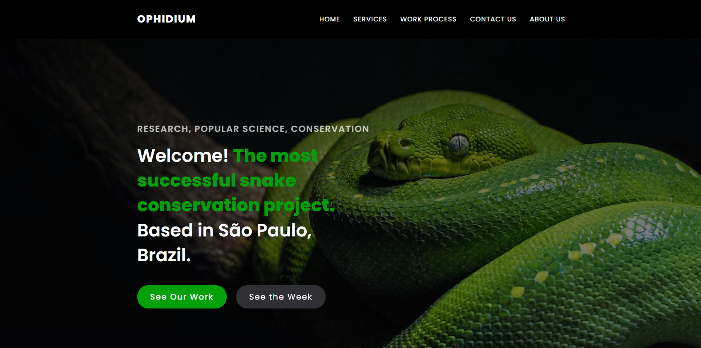

# Projeto Front-end - Ophidium

Projeto feito com o objetivo de aplicar na prática o conhecimento adquirido até agora ao nível de frontend development, proposto pelo meu atual curso [FLAG](https://flag.pt/curso/full-stack-web-developer).

## Conteúdo

- [Uso](#uso)
  - [Instalar Dependências](#instalar-dependências)
  - [Run CRA](#run-CRA)
- [Geral](#geral)
  - [Contexto](#contexto)
  - [Desafio](#desafio)
  - [Produto Final](#produto-final) -[Screenshot](#screenshot)
- [Processo](#processo)
  - [Feito com](#feito-com)
- [Melhorias e Futuro](#melhorias-e-futuro)

## Uso

Como iniciar o projeto:

### Instalar Dependências

`npm install`

### Run CRA

A app será executada em: localhost:3000

`npm start`

## Geral

### Contexto

Projeto proposto pelo meu curso [FLAG](https://flag.pt/curso/full-stack-web-developer).

Requisitos do projeto:
- Uso de React (✔); 
- Pelo menos 2 hooks (✔);
- Elaborar um CRUD (X);
- Uso de API externa ou dummy (✔);
- Boa semântica de HTML e CSS adequado (✔);
- Utilização de rotas (✔);
- Um simples formulário de validação (✔);
- State management (extra positivo, opcional) (X). 
  

### Desafio

O cliente é um centro de pesquisa e divulgação científica focado em serpentes. 
O solicitado foi uma plataforma que o público possa acessar a fim de obter informações sobre estes animais, suas famílias e várias espécies e subespécies. A plataforma deve ter um design simples porém elegante, de interação dinâmica e fácil entendimento para pessoas de qualquer escolaridade. 

### Produto Final

Uma app React semi-SP(Single-page) com:

- Homepage: Contendo seções com as principais informações sobre a instituição e a plataforma, como serviços prestados, espécies de serpentes mais procuradas, formulário de inscrição em Newsletter, apresentação do trabalho e como ele é feito. Conta também com uma seção Testimonials, exibindo organizações públicas pelas quais o centro de pesquisa é reconhecido. As seções são navegáveis de forma dinâmica através de um menu na Navbar e botões no Header.
  
- About page: Contendo conteúdo informátivo sobre o propósito do centro de pesquisa e uma Weather API com base em localização aproximada.

### Screenhot

## Processo

### Feito com

- HTML;
- CSS;
- Javascript;
- React.
  

Dependências utilizadas
- React-icons;
- React-Router-DOM;
- React-slick;
- Slick-carousel.

## Melhorias e Futuro

- Tornar a app um multi-page website;
- Trabalhar com State Management;
- Incrementar um CRUD;
- Incrementar uma API mais robusta e alinhada com a ideia do projeto;
- Trabalhar novos componentes, a fim de tornar a app um verdadeiro banco de dados sobre serpentes;
- Melhorar o design, estilos, layout como um todo, inclusive uso de animações;
- Se possível, alinhar o projeto com os conhecimentos obtidos nos meses restantes do curso, focando em back-end.
